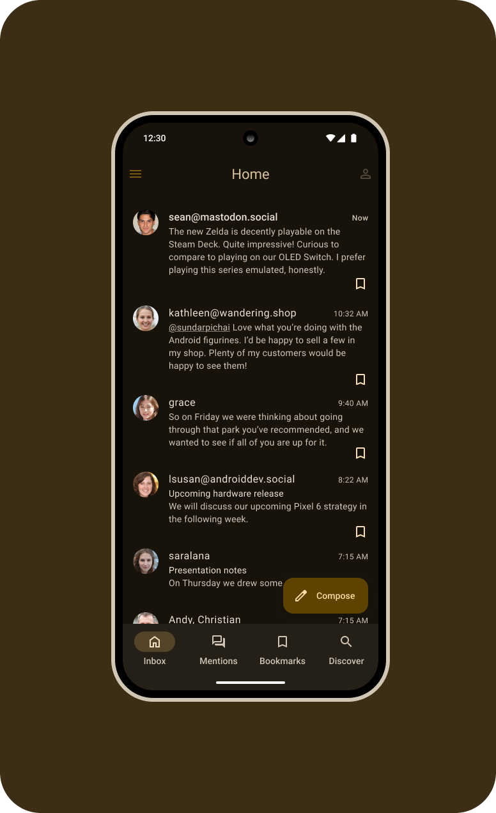

# MicroCompose: A Micro.blog Client

MicroCompose is an Android application built with Jetpack Compose that serves as a client for the Micro.blog platform. It allows users to interact with their Micro.blog accounts, view timelines, and post new content.



## Features

*   **Timeline Viewing:** Browse your Micro.blog timeline.
*   **Create Posts:** Compose and publish new microposts.
*   **View User Posts:** See posts from specific users.
*   **Authentication:** Secure sign-in using email and token verification via deep linking (`microcompose://signin/{token}`).

## Tech Stack

*   **Kotlin:** The primary programming language.
*   **Jetpack Compose:** Used for building the user interface.
*   **Hilt:** For dependency injection.
*   **Ktor:** For network communication with the Micro.blog API.
*   **Coil:** For image loading and display.
*   **Kotlinx Serialization:** For parsing JSON data.

## Setup and Build

1.  Clone the repository:
    ```bash
    git clone https://github.com/michaelbrownjr/microcompose.git
    ```
2.  Open the project in Android Studio.
3.  Let Android Studio sync and download the necessary Gradle dependencies.
4.  Build and run the application on an Android emulator or a physical device.

## Contributing

Contributions are welcome! If you find any issues or have suggestions for improvements, please feel free to:

*   Open an issue in the project's issue tracker.
*   Fork the repository, make your changes, and submit a pull request.
